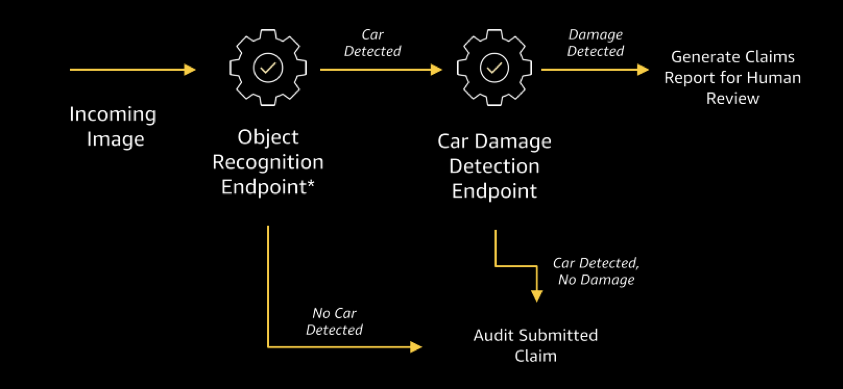
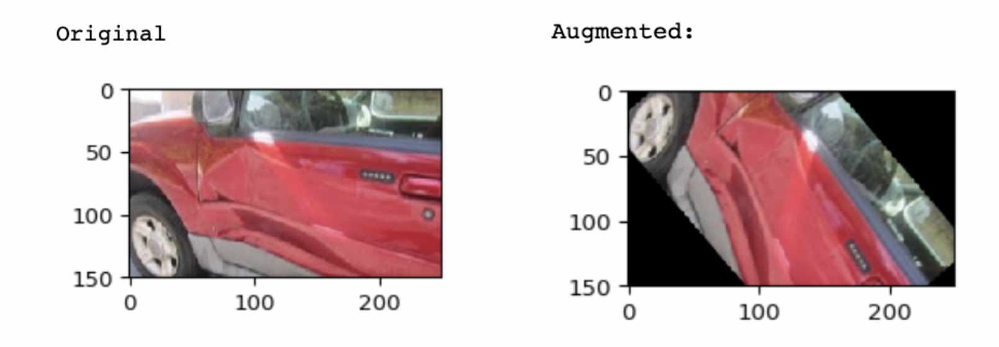

# Practical Guide: Using Amazon SageMaker Operators 


## Overview

As machine learning becomes more pervasive and a staple part of an organization’s production workloads, its important to be able to develop and manage scalable architectures and pipelines. If you’re a Machine Learning Practitioner, Data Scientist, Solution Architect, or have had any experience in operationalizing advanced workloads, then you’re probably aware of the technical (as well as business) challenges faced.

In this post we’re going to explore the topic of operationalizing machine learning workloads; moving away from the initial experimentation, testing and evaluation process, to a production ready environment. We’ll focus specifically on how do you move from the data science notebook environment (e.g. Jupyter Notebooks), to a container-based environment where workloads can be deployed and managed in an automated fashion.

If you’re an avid fan of Kubernetes and Amazon SageMaker for developing and deploying your machine learning models, then this blog post will hopefully provide you some useful guidance and ideas to use in your own organization. 


## Background: Operationalizing Machine Learning Workloads
The use of machine learning has become a core pillar of many organizations and industries; agriculture, automotive, healthcare, finance, oil and gas, government, retail, they all are using different forms of machine learning models to complement, enhance, and innovate their existing lines of business. Typical machine learning tasks can include use cases such as financial forecasting, customer churn and propensity modelling, classification tasks such as predicting whether a mechanical part will fail or an email is spam, to more complex tasks such as object recognition, natural language processing (chat bots), and even models to support autonomous driving (Reinforcement Learning)

If we take a step back, for many of the examples above, obtaining, storing, cleaning, and structuring the data is an essential initial (and ongoing) step to building any useful machine learning model. This in itself is an expensive exercise and requires significant human and computational resources, and it’s important to recognize that before any machine learning workloads or worthwhile experimentations can really be achieved, an organizations’ data capabilities really need to be in-place. 

However, what happens when an organization is in the position to begin their machine learning journey, and how do they go from data science experiments to operationalized solutions, with the least amount of disruption. The key here is to being able to move quickly between experimentation environments, to general purposes architectures, such as Kubernetes, which is a common environment for many AWS customers.



## Experimentation First
Let’s switch gears for a minute and think about the first stage in this process. Assume that we’ve got some great data sources, and we’re ready to develop a machine learning process to complement (and many in the future, replace) an existing business process. The first step in this process (beyond the business and organizational consultation and approvals), will be to an some initial hypothesis which effectively state what we’re trying to prove (or disprove). As the focus of this post is to talk about the path to production, we will only focus on the processes at a high-level, it’s important (and sometimes a forgotten element) step to enforce: a hypothesis drives and sets the scope of every data science experiment. 

As the data science experimentation begins, there will most likely be an iterative process of exploring data, feature analysis (e.g. which points in the data are important, and which are not conducive to proving the hypothesis), and eventually some form of modelling. For instance, in a simple example of developing a forecast model to help predict the revenue of a particular product line, there may be hundreds of fields stored about the sales of the product, and it’s the job of the data science team to decide features that are useful in predicting sales numbers. In some cases, feature engineering – the process of developing new features from existing data – may be required, which again needs further iterating and improvement. In order to achieve this, services such as Amazon SageMaker provides an excellent and comprehensive environment to experiment and test new machine learning models. Throughout this process, the hypothesis drives the experimentation, and the modelling are combined with the appropriate statistical tests to prove or disprove the hypothesis, which, if translated to the business objective: does the model help improve the business by some metric. In the case of the sales example, it helps the account executives predict with some level of error, the forecast of sales for a given time period, which can help account planning and setting realistic revenue targets. 

## Operationalizing Experiments 
Unless an organization’s data science practice is extremely mature and have established data science processes, the code developed to build these models will most likely reside in data science notebooks, and resemble a series of executable code fragments which perform different tasks such as data transformations, renaming columns, etc. These can become quite messy code bases to work from, especially when revisiting them and executing them after some time has passed (we’ll get to this). Knowing which code fragments to run can be a challenge, especially without extensive documentation or consulting members from the original data science tea. Unfortunately, as we’ve seen, this is a real scenario; the process of model training is not a one-off activity; model training and re-training is an ongoing exercise for the lifetime for the operational lifetime of a model. As new data is available, or as the prediction accuracy of a model starts to drift, then re-training is required. 

At this point, an organization have several options to transform experimental data science notebook code into a form which can be operationalized: 
    - Rewriting the code into a structure which can be executed in a more intuitive and meaningful way. This may involve requiring the help of production engineers or developers. As part of this, the team will need to think about how the solution can be integrated with the existing infrastructure and architecture, including connectivity to data sources, compute resources, etc.
    - A lighter approach would be to clean up the code in the notebooks, and set scheduled tasks to execute the code when required (e.g. Weekly batch process). A downside to this approach is that if further experimentation is required (e.g. new features, different model parameters), the scheduled tasks and cleaned up notebooks may need to be constantly re-engineered to accommodate experimentation, this run the risk of having multiple versions notebooks of running in parallel, and lead to heavy code management overheads.
    - An alternative approach would be to take advantage of the interoperability between notebook environments which offer the same functionality in more commonly used container based environments, such as Amazon Kubernetes Service and Amazon SageMaker, to easily transition from experiment to production. 

Let’s take a look at how AWS can be used to mode from experimentation to production in a containerized environment by using the recently released Amazon SageMaker Operators.
 
### Amazon SageMaker Operators for Kubernetes
In December 2019, AWS announced the launch of [Amazon SageMaker Operators for Kubernetes](https://aws.amazon.com/blogs/machine-learning/introducing-amazon-SageMaker-operators-for-kubernetes/), which allows for simple integration between Amazon SageMaker and Kubernetes. If you’re unfamiliar with the concepts of containers, I’d encourage you to take a look at this article (TO ADD). There are many reasons why an organization use or would consider the use of a container-based services such as Kubernetes, and to quote the article by Cade:

> *‘Building a model are often one part of a bigger pipeline that spans multiple engineering teams and services that support an overarching application. Kubernetes users, including EKS customers, deploy workloads by writing configuration files, which Kubernetes matches with available compute resources in your Kubernetes cluster. While Kubernetes gives you control and portability, running ML workloads on a Kubernetes cluster brings unique challenges. For example, the underlying infrastructure requires additional management, such as optimizing for utilization, cost, and performance; complying with appropriate security and regulatory requirements; and ensuring high availability and reliability. This undifferentiated heavy lifting takes away valuable time and resources from bringing new ML applications to market.’*

Amazon SageMaker Operators for Kubernetes helps address some of these challenges, whilst at the same time improves the process of transitioning from experimentation to deployed ML workloads.

> *‘Amazon SageMaker Operator for Kubernetes provides you with a native Kubernetes experience for creating and interacting with your jobs, either with the Kubernetes API or with Kubernetes command line utilities such as kubectl. Engineering teams can build automation, tooling, and custom interfaces for data scientists in Kubernetes by using these operators—all without building, maintaining, or optimizing ML infrastructure. Data scientists and developers familiar with Kubernetes can compose and interact with Amazon SageMaker training, tuning, and inference jobs natively, as you would with Kubernetes jobs executing locally. Logs from Amazon SageMaker jobs stream back to Kubernetes, allowing you to natively view logs for your model training, tuning, and prediction jobs in your command line’*

Please note, in order to follow some of the content in this post, you’ll need to complete the walkthrough provided in the aforementioned AWS blog post on [Amazon SageMaker Operators for Kubernetes](https://aws.amazon.com/blogs/machine-learning/introducing-amazon-SageMaker-operators-for-kubernetes/).

## Practical Example: Car Insurance Fraud Detection 
Given this, the next part of this post will describe the process of developing a machine learning model from scratch using Amazon SageMaker, which involves moving from the experimental process of building and testing the models, to moving the workload to EKS. For this example, we’re going to explore the development of a car insurance fraud detector use case, which involves using computer vision to determine whether an insurance claim is real or fake. Global insurance company’s receive thousands of incoming insurance claims daily, which takes up significant human resources to verify whether the claims are real or suspicious. The use of a machine learning driven system may be able to help reduce the burden placed on human resources to audit each insurance claim. 

### SageMaker Development: Data and Experimentation
In order to develop to develop a car insurance claim fraud detector, machine learning models will be required to first detect if the image uploaded with the claim contains a car, and then secondly, if it does contain a car, is the car damaged. This is quite a trivial example, however, as we shall see, achieving results which are acceptable for use in a production system is a complex process. In this section we’re going to walk through the data preparation process, and then the steps required to build our image classification models using Amazon SageMaker. In order to follow along with this example, please take a look at the notebook code [here](Data-Preparation/Data%20Preparation%20-%20Car%20Damage%20Data.ipynb). For this demo, we’re also going to be using Amazon SageMaker pre-trained algorithms, which provide an excellent starting point for building our own models


#### Step 1: Data Collection and Processing:
For this use case example, we’re going to need data which contains images of both damaged and non-damaged vehicles, as well as lots of images of vehicles. For an insurance company, these datasets would be more readily available (yet still requiring a lot of processing), however for this example, we’re going to be using a dataset of 1.5k damaged car images which can be found [here](https://www.kaggle.com/anujms/car-damage-detection). Whilst the data we’re using already has labels (e.g. damaged, not-damaged), it would be possible to use a service such as Amazon SageMaker Ground Truth to build and refine an unlabeled dataset, such as an organizations archived dataset of images.


If we take a look at the dataset the images above, they depict damage to a car, or images or a car without any damages. Some images contain the whole car, some contain just the car select component of a car (e.g. door, fender). As with most successful machine learning models, a richer, bigger dataset is always advantageous; If the model can learn from more data points, the model will have a better chance of building a function which can predict more actually on data it hasn’t seen before. Although our data is only 1.5k images, we’re going to use some data augmentation techniques to perform a series of transformations of our data to generate more versions of a given image. These transformations may involve skewing, rotating, adding blur, masking, or adding layers. In order to complete our data augmentation tasks, we use the ```imgaug``` library, which provides a selection of transformation approaches, as well as parallel batch processing of operations.

To begin with we load our data from the associated Amazon S3 bucket into memory of the compute instance running the Jupyter Notebook. Note, for larger dataset sizes, we would require to stream these operations, and we may not be able to manage all these operations in memory.

Illustrating a simple augmentation, we apply the ```augment_image``` function to one of the images, as show below, by applying the following code, we are able to generate a new image rotated by a given amount:

```python
rotate = iaa.Affine(rotate=(-125, 125))
image_aug = rotate.augment_image(image)
```
  



If we take a look at the data preparation notebook, there is a ```complex_augmenter``` function in which we can load in our source images, and generate a number of batches for each of the images:

```python
def complex_augmenter(images, batches = 100):

    NB_BATCHES = batches
    batches = [UnnormalizedBatch(images=images) for _ in range(NB_BATCHES)]
    
    
    #...
        seq = iaa.Sequential(
        [
            # apply the following augmenters to most images
            iaa.Fliplr(0.5), # horizontally flip 50% of all images
            iaa.Flipud(0.2), # vertically flip 20% of all images
            # crop images by -5% to 10% of their height/width
            sometimes(iaa.CropAndPad(
                percent=(-0.05, 0.1),
                pad_mode=ia.ALL,
                pad_cval=(0, 255)
            )),
            sometimes(iaa.Affine(
                scale={"x": (0.8, 1.2), "y": (0.8, 1.2)}, # scale images to 80-120% of their size, individually per axis
                translate_percent={"x": (-0.2, 0.2), "y": (-0.2, 0.2)}, # translate by -20 to +20 percent (per axis)
                rotate=(-45, 45), # rotate by -45 to +45 degrees
                shear=(-16, 16), # shear by -16 to +16 degrees
                order=[0, 1], # use nearest neighbour or bilinear interpolation (fast)
                cval=(0, 255), # if mode is constant, use a cval between 0 and 255
                mode=ia.ALL # use any of scikit-image's warping modes (see 2nd image from the top for examples)
            )),
    #...

```

Once the batch processing of these images completes, the next step is to save it back t o the original S3 bucket where the initial, non-augmented data resides. For clarity, this data is structured as:
 - training/
 - training/augmented/
 - validation/
 - validation/augmented/

We will see why there is a separate training and validation folder structure in the next section.

We’re now ready to begin building our machine learning models using our new data, which has scaled up from the original 1,307 images, to now 130,700 images (100 times more images).

#### Step 2: Building a Car Damage Image Classifier
The next step in our process is to begin using our original and augmented image dataset to build a classifier for predicting the likelihood that an image contains a damaged car. As depicted in Figure X, we want to use two classifiers in our workflow, the first one will be used to detect if the image has a car in it, and the second will be to detect if the car is damaged or not. We’re going to concentrate on the latter first, then we’ll return to the first model later in this section.

If we take a look at the Car-Damage-Detection [notebook](Model-2-Car-Damage-Detector/Model-2-Car-Damage-Detection.ipynb), the workflow of the notebook follows the structure of: 

-	Loading Data Reference
-	Creating Data Manifest
-	Uploading Data Manifest
-	Create and Configure Estimator
-	Set Hyperparameters
-	Train Model
-	Deploy and Evaluate Model

If you’re not familiar with using Amazon SageMaker to build a Machine Learning Model, I’d encourage you to have a read [here](https://github.com/awslabs/amazon-sagemaker-workshop/tree/master/Introduction), as this will be useful as a starting point to understand the more complexities we’re going to discuss in this section.

As we’re going to be using our own data, in combination with a pre-trained SageMaker mode, (‘image-classifier’), it is necessary to first build a reference dataset to the images we’re going to be using to train the model. The reference dataset will provide details on the location of the image (relative to the S3 bucket), as well as the class it is associated with (class refers to the label of the image we’re trying to classify). In order to do this we have several options, which include creating a .lst file for our data which contains tab-separated columns of a running index, class, and location, or an AugmentedManifest file, which contains details of each data point, and it’s associated metadata. Deciding which option to use will depend on the type of the data, the volume of data to be ingested, and linked to this, the mode in which the data will be ingested (Pipe or File). In our example, as we have quite a large amount of data, we will need to use Pipe model, which means the data is not loaded into memory in one go, thus we need to use the AugmentedManifest. Details of generating this can be found here (REF), but if we take a look at the function ```create_dataset_manifest()```, in order to create the manifest, we simply iterate across all the files in our S3 bucket, and create a training and validation json file with the S3URL, class, and index of the files. Once this is done, we only need to upload the data, and no image data ever needs to be downloaded to the SageMaker Notebook. This is particularly important when we’re dealing with extremely large datasets.

As mentioned before, modelling will be driven by a hypothesis, and in the best-case scenario, the relevant statistical tests will be conducted to ensure that the model is performing correctly. As we’re building a classification model (independent if it’s images or text), we can run a series of commonly used tests to determine the performance and fit of our model, and depending on the outcome, adjust the parameters of the model to improve the results, reduce overfitting/underfitting, or class-related issues. In this example we’re not focusing on this aspect, but it’s important to bare this in mind when developing production systems. Using these metrics will be an important factor for knowing when models are performing well, and if they need to be retrained.

Before we start to build our models, as we’re going to use Transfer Learning with a pre-trained model, all we need to do is obtain the SageMaker image file of the image-classifier, which can be performed with one line of code:

```python
    training_image = get_image_uri(sess.boto_region_name, 'image-classification', repo_version="latest")
```

In our example, we can see that the```configure_estimator()``` and the  ```configure_hyperparams()``` functions contain a set of parameters which affect the structure, shape, and training of a model. One way to choose these hyperparameters is to perform expensive resource operations such as grid searching, which effectively searches the entire space of the parameters to find the most optimal set of parameters. Alternatively, SageMaker Hyperparameter Tuning can automate this process, and find the most optimal set of parameters, using more cost-effective approaches. For more information on this, take a look at this [article](https://aws.amazon.com/blogs/aws/sagemaker-automatic-model-tuning/).

```python
def configure_estimator(bucket_name, sess, training_image):

    s3_output_location = 's3://{}/output'.format(bucket_name)
    ic = sagemaker.estimator.Estimator(training_image,
                                             role, 
                                             train_instance_count=4, 
                                             train_instance_type='ml.p3.16xlarge',
                                             train_volume_size = 50,
                                             train_max_run = 360000,
                                             input_mode= 'Pipe',
                                             output_path=s3_output_location,
                                             sagemaker_session=sess)
    return ic
```   

When configuring the estimator, as we're using a large dataset to perform transfer learing with an exiting model, we set ```input_mode``` to ```Pipe```, and also specify the instance count and type. If the ```train_instance_count``` is greater than 1, the model training will automatically be distributed across nodes. Finally, we need to set the output location of the model once training has been completed. In practice this path should be revisioned in order to allow for multiple models to be saved, without overriding existing outputs.

```python    
def configure_hyperparams(ic):
    ic.set_hyperparameters(num_layers=18,
                             use_pretrained_model=1,
                             image_shape = "3,150,250",
                             num_classes=2,
                             mini_batch_size=32,
                             epochs=100,
                             learning_rate=0.001,
                             top_k=1,
                             num_training_samples=len(manifest_val),
                             precision_dtype='float32')
    
    return ic

```

In the given example, the hyperparameters have been set to reflect the data being used for training, e.g. the ```image_shape``` parameter has been set to 3 channels (R,G,B), of size 150 pixel (h) x 250 pixels (w). More details of the specific hyperparameters can be found in the notebook, but it's important to remmeber that manually configuring these requires the analysis of the training logs to determine how the model is performing.


Based on the parameters of the estimator, once training is initiated, SageMaker will automatically start the distributed model training process with the desired number of training compute instances. Once our training job has been completed, we now need to deploy the classifier to test how well it performed. SageMaker makes this such a simple process with only one line of code (model.deploy()), yet behind the scenes, SageMaker configures the necessary infrastructure and services to establish a scalable RESTFUL End point. At this point, model evaluation can be performed, which would be in the form of classification confusion matrices, AUC analysis, or residual plots. In the given example, the model development went through several iterations of the hyperparameters in order to achieve acceptable results.

As mentioned earlier, we’re using two models in this use case, and for the training of the other model (car detector), we are using a slightly different model from this example, as we want to be able to detect whether or not an image has a car, along with the bounding box of the object. In order to do this. We’re using the pre-trained Object-Detection algorithm available in SageMaker, which is trained on the CoCo dataset, which contains millions of images of many different objects. The reason why we want to use a more broader model for this process, is that we need to be able to detect multiple object within an image, and determine the likelihood that there is a car in the image. All the code for this model can be found in the this [notebook](Model-1-Car-Detector/Model-1-Object-Detection.ipynb).

So we’re now at the position where we’re happy with the performance of the models, but we need to take the experimental code, and transform it to a ML Pipeline. As mentioned before, we have several options, but we’re going to look at using EKS and SageMaker Operators for Kubernetes to achieve this.

#### Step 3: Configuring EKS for a SageMaker TrainingJob
In order to use SageMaker Operations in Kubernetes, we need to create a YAML file which contains all the necessary configurations to enable successful execution of the proposed SageMaker model training. As part of this file, it is essential to describe the location of the training data, data types, manifests (if applicable), and the hyperparameters of the model.

We’re going to give an example here of the YAML file to perform the Car Damage Detection model training.

```yaml
apiVersion: SageMaker.aws.amazon.com/v1
kind: TrainingJob
metadata:
  name: car-damage-detector
spec:
  roleArn: arn:aws:iam::170991494985:role/service-role/AmazonSageMaker-ExecutionRole-20191119T175598
  region: us-east-1
  algorithmSpecification:
    trainingImage: 811284229777.dkr.ecr.us-east-1.amazonaws.com/image-classification:1
    trainingInputMode: Pipe
  outputDataConfig:
    s3OutputPath: s3://dataset-cars-damage/models
  inputDataConfig:
    - channelName: train
      dataSource:
        s3DataSource:
          s3DataType: AugmentedManifestFile
          s3Uri: s3://dataset-cars-damage/train_lst/train_manifest.json
          s3DataDistributionType: FullyReplicated
          attributeNames: ["source-ref", "class"]
      contentType: application/x-image
      compressionType: None
      recordWrapperType: RecordIO
    - channelName: validation
      dataSource:
        s3DataSource:
          s3DataType: AugmentedManifestFile
          s3Uri: s3://dataset-cars-damage/val_lst/val_manifest.json
          s3DataDistributionType: FullyReplicated
          attributeNames: ["source-ref", "class"]
      contentType: application/x-image
      compressionType: None
      recordWrapperType: RecordIO
  resourceConfig:
    instanceCount: 4
    instanceType: ml.p3.16xlarge
    volumeSizeInGB: 5
  hyperParameters:
    - name: top_k
      value: "1"
    - name: num_training_samples
      value: "105434"
    - name: mini_batch_size
      value: "32"
    - name: learning_rate
      value: "0.001"
    - name: image_shape
      value: "3,150,250"
    - name: precision_dtype
      value: "float32"
    - name: num_layers
      value: "50"
    - name: use_pretrained_model
      value: "1"
    - name: num_classes
      value: "2"
    - name: epochs
      value: "100"
  stoppingCondition:
    maxRuntimeInSeconds: 360000
```

The [YAML file](SageMaker-Operators/TrainingJobs/car-damage-detector-training-pipeline.yaml) above contains the same parameters and configurations as listed in the SageMaker Notebook, but all compressed into one file, which can now be executed using the ```kubectl``` command to execute the entire ML training pipeline:

```ssh
$ kubectl apply -f car-damage-detector-training-pipeline,yaml 
```

After running this command, the EKS cluster will then spin up the necessary resources to support the workload and run the TrainingJob as configured.

In order to examine the logs of the training job, the following command can be executed:

```ssh
$ kubectl smlogs trainingjob car-damage-detector 
```

Which will result in a console output similar to the following, which reflects the metrics being used to measure the performance of the model against the training and validation data.

```ssh
car-damage-detector-4b1a19444bd011eab0ef0e980407102b/algo-1-1581317035 2020-02-10 07:09:20.215 +0000 UTC [02/10/2020 07:09:19 INFO 140575449093952] Epoch[7] Batch [820]#011Speed: 204.183 samples/sec#011accuracy=1.000000
car-damage-detector-4b1a19444bd011eab0ef0e980407102b/algo-1-1581317035 2020-02-10 07:09:20.216 +0000 UTC [02/10/2020 07:09:19 INFO 140575449093952] Epoch[7] Train-accuracy=1.000000
car-damage-detector-4b1a19444bd011eab0ef0e980407102b/algo-1-1581317035 2020-02-10 07:09:20.216 +0000 UTC [02/10/2020 07:09:19 INFO 140575449093952] Epoch[7] Time cost=128.797
car-damage-detector-4b1a19444bd011eab0ef0e980407102b/algo-4-1581317036 2020-02-10 07:09:20.592 +0000 UTC [02/10/2020 07:09:19 INFO 139941932451648] Epoch[7] Train-accuracy=1.000000
car-damage-detector-4b1a19444bd011eab0ef0e980407102b/algo-4-1581317036 2020-02-10 07:09:20.592 +0000 UTC [02/10/2020 07:09:19 INFO 139941932451648] Epoch[7] Time cost=128.827
car-damage-detector-4b1a19444bd011eab0ef0e980407102b/algo-3-1581317035 2020-02-10 07:09:20.594 +0000 UTC [02/10/2020 07:09:19 INFO 140050476062528] Epoch[7] Train-accuracy=1.000000
car-damage-detector-4b1a19444bd011eab0ef0e980407102b/algo-3-1581317035 2020-02-10 07:09:20.594 +0000 UTC [02/10/2020 07:09:19 INFO 140050476062528] Epoch[7] Time cost=128.801
car-damage-detector-4b1a19444bd011eab0ef0e980407102b/algo-3-1581317035 2020-02-10 07:10:06.61 +0000 UTC [02/10/2020 07:10:06 INFO 140050476062528] Epoch[7] Validation-accuracy=0.880992
car-damage-detector-4b1a19444bd011eab0ef0e980407102b/algo-1-1581317035 2020-02-10 07:10:12.234 +0000 UTC [02/10/2020 07:10:11 INFO 140575449093952] Epoch[7] Validation-accuracy=0.880992
car-damage-detector-4b1a19444bd011eab0ef0e980407102b/algo-4-1581317036 2020-02-10 07:10:13.611 +0000 UTC [02/10/2020 07:10:13 INFO 139941932451648] Epoch[7] Validation-accuracy=0.880992
```

So now we’re ready to move to the next step, we’ve build two models which perform a specific task well, and how do we take this and use it to support the existing business process.

#### Step 4: Wrapping the Models

The first step is going to require us to build a simple set of business logic of the different states of operation,  e.g. if we detect cars but no damage, or no cars detected. This can be achieved with fairly simple logic, and wrapping the model end-points with some switches to perform inferencing.

Let's take a look at the [Model Workflow Example Notebook](Model-Logic-Example/Model-Deployment-Logic-Example.ipynb)

To begin with, we’re going to wrap each of the models in a Python Class, and add some simple functions which wrap the ```.predict``` function of the SageMaker ```Estimator``` Class. We then instantiate these as new objects we can use in our logic:

```python
from objectdetector import ObjectDetector
from cardamagedetector import CarDamageDetector

od = ObjectDetector('object-detection-2020-01-30-07-10-53-209')
cdd = CarDamageDetector('image-classification-2020-02-07-05-24-20-993')
```

From here we can now build a simple function which maps the business logic stated in the Workflow Diagram.

```python
def determine_if_needs_audit_or_filing(od, cdd, image_url, acceptable_thresh = 0.1):
    
    obj_to_detect = 'car'
    expected_predicted_class = 'Damage'
    #download the image
    image_local_path = od.download_image(image_url, to_save_filename='test-image.jpg')
    #score the image with the first model
    classes_and_scores = od.visualize_detection(image_local_path, acceptable_thresh)
    print(classes_and_scores)
    #1. first run it through the obhect detector

    goto_second_classifier = False
    #Determine if a car exists in the object
    if obj_to_detect in classes_and_scores:
        if classes_and_scores[obj_to_detect] > acceptable_thresh:
            goto_second_classifier = True
    
    if goto_second_classifier:    
    #2. Now check if the image contains a damaged vehicle
        predicted_class = cdd.predict_if_contains_damage(image_local_path)
        if expected_predicted_class == 'Damage':
            print('No Audit Needed, execute workflow to create report')
        else:
            print('Audit Required')
```

We now have a function which can take an image URL, and use both models to determine whether the image contains a car, and if so, does the car contain damages! So, finally we execute the following code and end up with an output as follows

```python
url  = 'https://image.shutterstock.com/z/stock-photo-isolate-side-of-the-car-the-color-of-braun-white-which-crashed-with-another-car-until-it-was-596238068.jpg'
determine_if_needs_audit_or_filing(od, cdd, image_url = url)
```


However, this code doesn't have to reside within a notebook cell, this could be wrapped up and then used inside a AWS Lambda function, and called every time a new Insurance Claim is submitted, and the results appended to the claim case, for example.


## Summary
Hopefully, through this trivial example, you’ve seen that moving from experimentation to operationalized machine learning workflows can be achieved simply using Amazon SageMaker and Amazon EKS. In the example we’ve seen how the data science experimentations can then be transferred over to Kubernetes using Amazon SageMaker Operators for EKS, and how this allows for more simpler management of a reoccurring training job. However, this is only one part of the overall ML pipeline (not all could be covered in one post!), other workloads such as data Transformations and model deployment can also be performed using SageMaker Operators.

